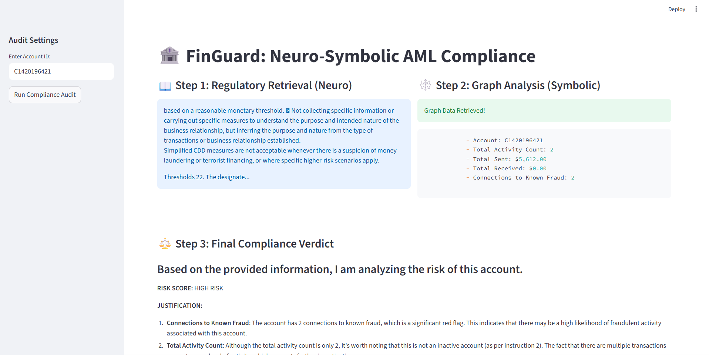

# FinGuard: Neuro-Symbolic AML Compliance Engine 🛡️🏦

FinGuard is an Explainable AI (XAI) system designed to automate Anti-Money Laundering (AML) audits. Unlike traditional black-box LLMs, FinGuard combines **Neural Retrieval (RAG)** with **Symbolic Reasoning (Knowledge Graphs)** to provide fact-checked compliance verdicts.

## 🚀 The Problem
Standard LLMs often "hallucinate" when checking financial transactions against thousands of pages of regulations. They lack the ability to trace multi-hop relationships (e.g., Money Laundering rings).

## 💡 The Solution: Neuro-Symbolic Architecture
- **Neuro (The Brain):** Uses **LangChain** and **Llama-3.2** to interpret FATF global regulations and generate search queries.
- **Symbolic (The Facts):** Uses a **Neo4j Knowledge Graph** to map transactions as nodes and relationships, ensuring 100% factual accuracy in identifying "spider-web" fraud patterns.

## 🛠️ Tech Stack
- **AI Framework:** LangChain
- **LLM:** Ollama (Llama-3.2)
- **Vector DB:** ChromaDB (for indexing PDF regulations)
- **Knowledge Graph:** Neo4j (Graph Database)
- **Data:** PaySim Synthetic Financial Dataset
- **UI:** Streamlit

## 📸 Demo

## 🛠️ Installation & Setup
1. **Clone the repo:** `git clone https://github.com/YOUR_USERNAME/FinGuard.git`
2. **Install Dependencies:** `pip install -r requirements.txt`
3. **Setup Databases:** 
   - Start Neo4j Desktop and create an instance named `FinGuardDB`.
   - Run the ingestion script in `notebooks/3_symbolic_graph.ipynb`.
4. **Run the App:** `streamlit run app.py`

## 📈 Impact & Use Case
This system demonstrates how financial institutions can move from manual "sampling" to 100% automated auditing with a clear "Reasoning Trace" for regulators.